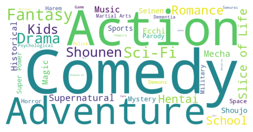

# Laporan Proyek Machine Learning - Faizah Mappanyompa

## Project Overview

Anime merupakan animasi yang berasal dari Negara Jepang dalam bentuk hiburan visual yang memiliki berbagai genre [1]. Pesatnya pertumbuhan industri ini, seringkali penonton merasa kewalahan untuk memilih dan menonton anime sesuai preferensi mereka. Untuk mengatasi tantangan ini, sistem rekomendasi anime menjadi kebutuhan yang potensial.

Penelitian sebelumnya terkait sistem rekomendasi anime telah dilakukan oleh (Girsang et.al, 2019) [2] menggunakan Collaborative Systems berdasarkan histori user menggunakan kumpulan data sebesar 100.000. Hasil penelitian menunjukkan cara yang sangat sederhana namun efisien untuk sistem rekomendasi.

Pada penelitian kali ini, peneliti melakukan anime recommendation menggunakan content-based filtering system. Dataset yang digunakan berasal dari Kaggle [3] dengan feature judul anime `name` dan `genre` yang akan diteliti lebih lanjut.

## Business Understanding

### Problem Statements

Bedasarkan latar belakang di atas, berikut beberapa rumusan masalah yang perlu diselesaikan:

1. Bagaimana sistem content-based filtering dapat membuat sistem rekomendasi anime yang akurat berdasarkan fitur yang diberikan?

### Goals

Adapun tujuan dari penelitian ini sebagai berikut:

- Membangun sistem rekomendasi yang akurat menggunakan content-based filtering systems.

## Data Understanding

Dataset yang digunakan berasal dari [Kaggle](https://www.kaggle.com/datasets/CooperUnion/anime-recommendations-database/data) [3]. Database ini memiliki dua dataset yaitu `anime.csv` dan `rating.csv`. Dataset `anime.csv` memiliki ukuran sebesar (12294, 7) dan `rating.csv` sebesar (7813737, 3). Namun, untuk tahap selanjutnya, fitur yang akan digunakan hanyalah `name` dan `genre` dari anime. Untuk saat ini agar dapat mengeksplorasi dataset lebih jauh, ukuran dataset yang digunakan belum diubah. Adapun variabel-variabel pada Anime Recommendations Database sebagai berikut:

**Anime.csv**

- anime_id - id unik anime dari myanimelist.net's
- name - judul anime
- genre - genre dari anime, dipisahkan dengan koma
- type - tipe anime berupa movie (film), TV, OVA (original animation video), ONA (Original Net Animations), Music (musik), dan Special (spesial)
- episodes - berapa banyak episode (1 jika movie)
- rating - rata-rata nilai rating anime dari 10
- members - jumlah member dari komunitas anime tersebut

**Rating.csv**

- user_id - id pengguna yang dihasilkan secara acak dan tidak dapat diidentifikasi.
- anime_id - id anime yang sudah dirating user.
- rating - rating yang diberikan user dari 10 (bernilai -1 jika user sudah menonton anime tetapi tidak memberikan rating).

### Univariate EDA

- Periksa informasi mengenai fitur-fitur yang ada di df_anime dan df_rating menggunakan `.info()`
- Periksa jumlah setiap genre `df_anime['genre]` menggunakan `.value_counts()` yang dipisahkan dengan tanda koma. Jika kata dalam word cloud memiliki ukuran yang lebih besar maka kata tersebut memiliki frekuensi atau genre yang lebih banyak pada anime. Begitupun sebaliknya. Pada gambar dibawah, anime dengan genre action, comedy, dan adventure merupakan genre yang paling banyak di anime.

  

- Periksa apakah terdapat duplikasi pada kolom anime menggunakan `.duplicated().sum()`

## Data Pre-Processing

1. Rename kolom `rating` menjadi `rating_user` untuk df_rating, agar tidak memiliki nama yang sama ketika akan dimerge
2. Gabungkan df_rating dan df_anime ke dalam variable `all_anime_df`.

## Data Preparation

1. Periksa kembali gabungan hasil kedua dataframe menggunakan `.info()`
2. Untuk user yang tidak rating atau -1 diberikan nilai NaN. Nilai NaN dipilih karena pada pandas NaN dinotasikan sebagai missing value. Hal ini sama saja dengan user yang tidak memberikan nilai rating sama sekali atau bernilai 0 (tidak berpengaruh pada rekomendasi).
3. Drop kolom yang duplikasi terutama pada `anime_id` dan `name`. Drop tersebut dilakukan untuk melakukan sistem rekomendasi pada nama anime dengan genrenya, sehingga tidak boleh duplikat.
4. Agar mudah dibaca dan dipahami oleh mesin, feature name dan genre akan dilakukan cleaning jika memiliki nilai &quot, .hack//, ', A's, I', dan & menggunakan library regex.
5. Ukuran dataframe berubah menjadi (9892, 9) setelah drop kolom yang duplikat

## Modeling

### TF-IDF

TF-IDF (Term Frequency-Inverse Document Frequency) merupakan teknik pada sistem rekomendasi terutama pada content-based filtering. Vektor pada TF-IDF dapat digunakan untuk menghitung cosine-similarity antara data anime. Hasil similarity ini akan membantu sistem rekomendasi dalam menentukan item yang mirip.

1. Sebelum masuk ke tahap modelling, data akan dilakukan TF-IDF `TfidfVectorizer` terlebih dahulu untuk menemukan representasi fitur penting dari setiap genre anime.
2. Lakukan fit dan transformasi ke dalam bentuk matriks. Hasilnya berupa 9892 nama anime dengan 47 genre.
3. Untuk menghasilkan vektor TF-IDF dalam bentuk matriks, gunakan fungsi `todense()`
4. Dataframe dibawah dibuat untuk melihat matriks tf-idf untuk beberapa anime dan genrenya.

### Cosine-Similarity

1. Hitung similarity degree antar anime dengan teknik Cosine-Similarity.
2. Teknik ini digunakan untuk identifikasi kesamaan antara satu anime dengan anime lainnya.
   Adapun rumus cosine sebagai berikut:

   

Dimana:

- A dan B: vektor item

  

- merupakan dot product dari vektor A dan B

   

- merupakan norma Euclidean dari vektor A dan B

Sebagai contoh terdapat dua vektor:

- A = [2,0]
- B = [0,2]

Maka:

A x B = (2 x 0) + (0 x 2) = 0

||A|| = 2

||B|| = 2

Maka Cosine sim = 0/4 = 0. Nilai dari Cos 0 adalah 1. Artinya kedua vektor A dan B memiliki similarity bernilai 1 (sangat mirip).

### Membuat Fungsi Rekomendasi

Fungsi ini yang merekomendasikan anime yang relevan.

1. Buatlah sebuah fungsi anime_recommendations dengan parameter:
   - anime_name: nama anime
   - similarity_data: fungsi cosine-similarity
   - items: name dan genre
   - k : banyak rekomendasi yang ingin diberikan
   - Keluaran sistem rekomendasi berupa top-N recommendation. Misalnya jika N=5 maka akan merekomendasikan top 5 anime.
2. Beberapa penjelasan method dan variable yang digunakan:
   - argpartition: mengambil sejumlah nilai k tertinggi dari similarity function
   - kemudian, ambil data dari bobot tertinggi ke rendah dan masukkan data ini ke variable closest
   - dalam hal ini kita ingin cari rekomendasi dari anime berjudul Tentai Senshi Sunred, sehingga drop anime dengan judul ini agar tidak muncul dalam daftar rekomendasi (tidak double).

Contoh Output:

`anime_recommendations('Tentai Senshi Sunred')` memberikan 5 rekomendasi anime berupa:

| num |                       name                        |                               genre |
| :-- | :-----------------------------------------------: | ----------------------------------: |
| 0   |          Tentai Senshi Sunred 2nd Season          | Comedy, Parody, Seinen, Super Power |
| 1   |        Tentai Senshi Sunred: Short Corner         | Comedy, Parody, Seinen, Super Power |
| 2   |     Kawasaki Frontale x Tentai Senshi Sunred      | Comedy, Parody, Seinen, Super Power |
| 3   | Kawasaki Frontale x Tentai Senshi Sunred 2nd S... | Comedy, Parody, Seinen, Super Power |
| 4   |            Himitsukessha Taka no Tsume            |         Comedy, Parody, Super Power |

## Evaluation

Metrik yang digunakan pada model ini adalah Precision score. Adapun mengapa precision score dipilih, karena berfokus pada keakuratan sistem dalam merekomendasikan anime yang relevan bagi pengguna. Precision score pada sistem rekomendasi memiliki rumus n rekomendasi yang relevan / n item yang direkomendasikan. Detailnya sebagai berikut:

Sebagai contoh `anime_recommendations('Tentai Senshi Sunred')` memberikan rekomendasi seperti tabel di atas.

Genre pada anime Tentai Senshi Sunred adalah Comedy, Parody, Seinen, Super Power. Maka dari 5 item yang direkomendasikan, anime dari nomor 0-3 memiliki kategori yang persis sama dengan anime Tentai. Artinya nilai Precision sebesar:

P = 4/5 = 0.8 = 80%

Jadi, nilai precision score pada anime Tentai Senshi Sunred adalah 80%.

Bedasarkan problem statement diatas, solusi pertama sudah terpenuhi:

1. Sistem atau metode yang digunakan yaitu Content-Based Filtering Systems. Content-based filtering ini memiliki pendekatan dengan mengandalkan karakteristik dari item yang direkomendasikan, dalam hal ini genre dan name pada anime. Sistem ini dapat memberikan rekomendasi yang akurat pada 5 anime yang relevan berdasarkan kategori dan nama anime.

## Conclusion

Sistem rekomendasi penting untuk melakukan personalisasi sesuai preferensi user. Penelitian kali ini akan membuat sebuah sistem rekomendasi anime menggunakan content-based filtering systems. Tujuannya untuk membangun sistem rekomendasi anime yang akurat sesuai preferensi user. Adapun fitur utama yang akan digunakan yaitu nama dan genre dari anime.

Setelah dilakukan EDA dan pre-processing, data siap dimasukkan ke modelling. Di tahap ini data akan dilakukan proses TF-IDF untuk menemukan representasi fitur penting. Kemudian, dihitung sudut kemiripan menggunakan Cosine-Similarity untuk identifikasi kesamaan antara satu anime dengan anime lainnya.

Setelah itu, buat fungsi rekomendasi anime. Terakhir, lakukan evaluation menggunakan precision score untuk mengukur akurasi dari data yang diprediksi.

## References

[1] B. S. Pamungkas, and S. Bairewi. "SISTEM REKOMENDASI ANIME DAN MANGA MENGGUNAKAN SOCIAL RECOMMENDATION ALGORITHM BASED ON THE CONTEXT OF TIME AND TAGS," REPOSITORY UNIVERSITAS MIKROSKIL, May 2017.

[2] A. S. Girsang, B. Al Faruq, H. R. Herlianto, and S. Simbolon, “Collaborative Recommendation System in Users of Anime Films,” Journal of Physics: Conference Series, vol. 1566, no. 1, p. 012057, Jun. 2020, doi: https://doi.org/10.1088/1742-6596/1566/1/012057.

[3] “Anime Recommendations Database,” www.kaggle.com. https://www.kaggle.com/datasets/CooperUnion/anime-recommendations-database/data (accessed Nov. 30, 2023).
‌
